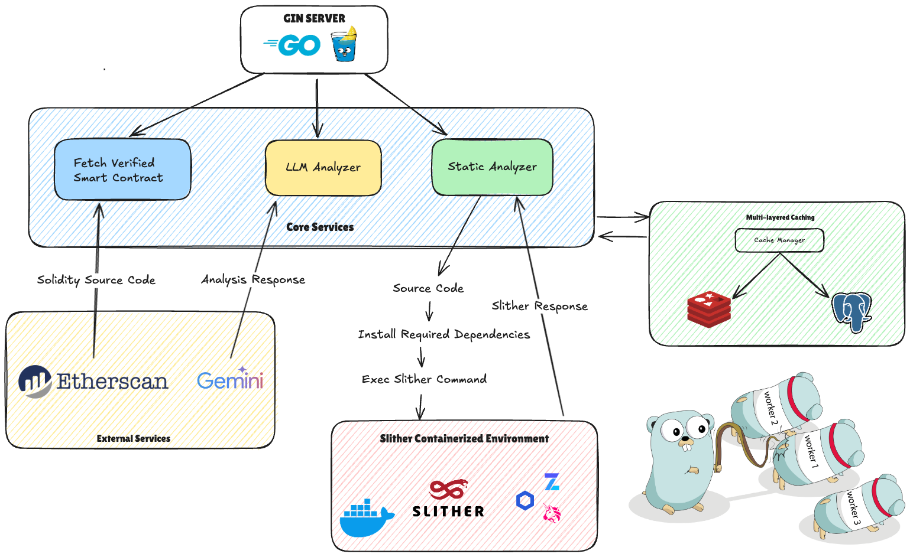

# Slythr - Solidity Smart Contract Security Analyzer

[](https://golang.org/)
[](https://www.docker.com/)
[](LICENSE)
[](http://localhost:8080/swagger/index.html)

Slythr is a smart contract security analysis platform that provides comprehensive vulnerability detection for Solidity contracts through RESTful APIs. Built with Golang, it eliminates the complexity of local tooling installation while delivering scalable, production-ready security analysis.

## Key Features

**API-First Architecture**
- RESTful API interface eliminates need for local Slither installation
- Frontend-ready endpoints for seamless integration
- Comprehensive JSON responses with structured vulnerability data

**Advanced Analysis Capabilities**
- Static analysis powered by containerized Slither environment
- AI-driven security assessment using Google Gemini
- Multi-file project analysis with dependency resolution
- Cross-contract vulnerability detection

**Performance**
- Multi-layer caching strategy (Redis L1 + PostgreSQL L2)
- Intelligent deduplication through source code hashing
- Concurrent analysis processing for optimal throughput
- Smart contract verification and fetching from Etherscan

**Production-Ready Infrastructure**
- Clean Architecture with clear separation of concerns
- Containerized deployment with Docker Compose
- Comprehensive health monitoring and metrics
- Scalable microservice architecture

## Architecture

The system follows Clean Architecture principles with dependency inversion:



## Technology Stack

| Component | Technology | Purpose |
|-----------|------------|---------|
| **Backend** | Go 1.24+ | High-performance API server |
| **Web Framework** | Gin Gonic | HTTP routing and middleware |
| **Database** | PostgreSQL | Data persistence and analysis history |
| **Cache** | Redis | High-speed result caching |
| **ORM** | GORM | Database abstraction |
| **Containerization** | Docker Compose | Service orchestration |
| **Static Analysis** | Slither (Containerized) | Vulnerability detection |
| **AI Analysis** | Google Gemini | Contextual security insights |

## Quick Start

### Prerequisites

- [Go 1.24+](https://golang.org/doc/install)
- [Docker](https://docs.docker.com/get-docker/) & [Docker Compose](https://docs.docker.com/compose/install/)

### Installation

1. **Clone and configure**
   ```bash
   git clone https://github.com/Azzurriii/slythr-go-backend.git
   cd slythr-go-backend
   cp .env.example .env
   ```

2. **Set required environment variables**
   ```env
   ETHERSCAN_API_KEY=your_etherscan_api_key
   GEMINI_API_KEY=your_gemini_api_key
   
   DB_HOST=postgres
   DB_USER=slythr
   DB_PASSWORD=secure_password
   DB_NAME=slythr_db
   
   REDIS_HOST=redis
   SERVER_PORT=8080
   ```

3. **Start services**
   ```bash
   make docker-run
   # or
   docker-compose up -d
   ```

4. **Verify deployment**
   ```bash
   curl http://localhost:8080/health
   ```

API documentation available at: `http://localhost:8080/swagger/index.html`

## Development

### Local Development

```bash
# Install dependencies
go mod download

# Run database migrations
make migrate-up

# Start development server
make dev
```

### Available Commands

```bash
# Development
make dev              # Start development server
make test             # Run all tests
make test-cover       # Run tests with coverage
make lint             # Run code linters

# Database
make migrate-up       # Apply database migrations
make migrate-down     # Rollback migrations

# Docker
make docker-build     # Build Docker images
make docker-run       # Start all services
make docker-stop      # Stop all services
make docker-clean     # Clean containers and images

# Documentation
make docs             # Generate Swagger documentation
```

## Project Structure

```
slythr-go-backend/
├── cmd/api/                    # Application entry point
├── config/                     # Configuration management
├── docs/                       # Swagger API documentation
├── internal/
│   ├── application/            # Application layer (services, use cases)
│   ├── domain/                 # Domain layer (entities, repositories)
│   ├── infrastructure/         # Infrastructure (database, cache, external APIs)
│   └── interface/              # Interface layer (HTTP handlers, routes)
├── pkg/                        # Shared utilities and packages
├── scripts/                    # Database migrations and scripts
├── tests/                      # Test files and fixtures
├── docker-compose.yml          # Service orchestration
├── Dockerfile                  # Main application container
├── Dockerfile.slither          # Slither analysis environment
└── Makefile                    # Development automation
```

## API Documentation

Complete API documentation is available via Swagger UI at `/swagger/index.html` when the server is running. The documentation includes:

- Interactive API explorer
- Request/response schemas
- Authentication requirements
- Error code explanations
- Usage examples

## Contributing

1. Fork the repository
2. Create a feature branch (`git checkout -b feature/new-feature`)
3. Implement changes with tests
4. Ensure all tests pass (`make test`)
5. Submit a pull request

### Code Standards

- Follow Go best practices and conventions
- Maintain test coverage above 90%
- Use meaningful commit messages
- Document public APIs with comments
- Run linters before submitting PRs

## License

This project is licensed under the MIT License - see the [LICENSE](LICENSE) file for details.

## Support

- **API Documentation**: [Swagger UI](http://localhost:8080/swagger/index.html)
- **Issues**: [GitHub Issues](https://github.com/Azzurriii/slythr-go-backend/issues)
- **Repository**: [GitHub](https://github.com/Azzurriii/slythr-go-backend)